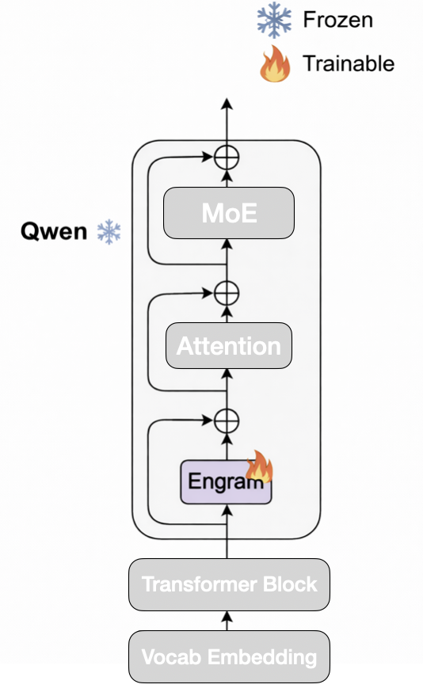
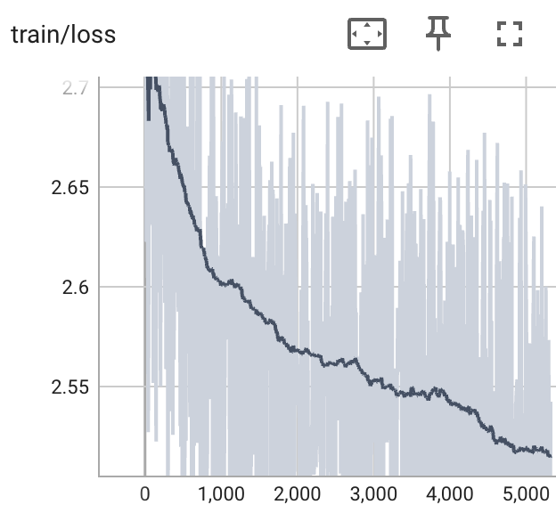
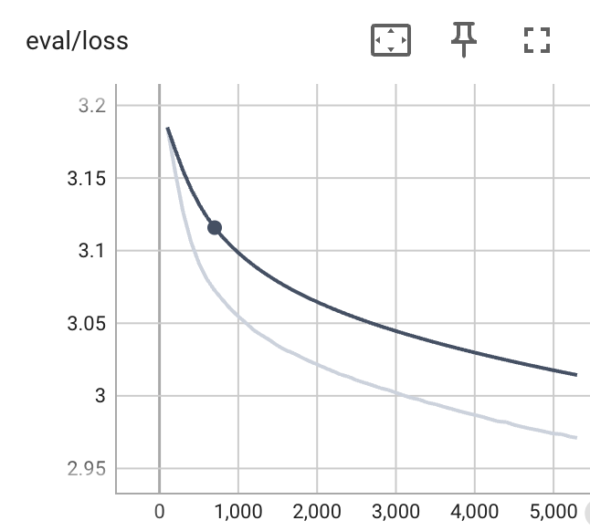
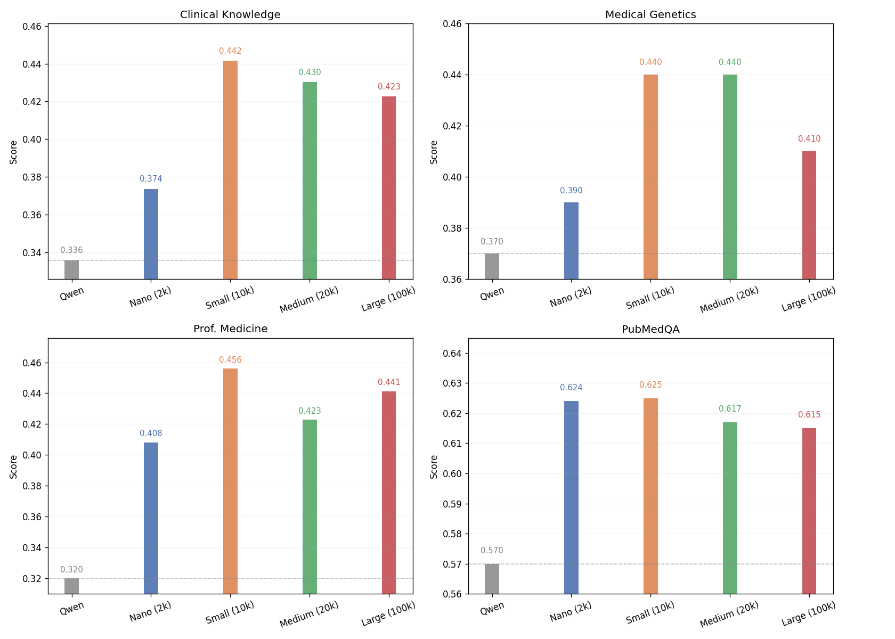

<div align="center">
  

# TinyEngram: Exploring New Axis of Scaling
</div>

> **TL;DR** In this repo, we study properties and applications of Engram. More findings are on the way!


TinyEngram is an open research project exploring the [Engram](https://github.com/deepseek-ai/Engram) architecture—an LLM enhancement that boosts phrase-level understanding by integrating a compact N-gram memory module and a gated retrieval mechanism into key transformer layers.

Built on [Qwen](https://github.com/QwenLM/Qwen), TinyEngram provides a lightweight, ready-to-train codebase for anyone to reproduce, experiment with, or extend Engram-style models. We actively share new experiments, training logs, and findings right here—making this repo both a toolkit and a living research notebook.

You are welcome to propose any questions in the [Issues](https://github.com/AutoArk/TinyEngram/issues). We will burn our own GPUs to research on any interesting questions. Join us in  evolving how LLMs remember what matters! 🧠✨

## 🧪 Key Finding 1. Engram as Parameter Efficient Fine-Tuning Method


### 1. Engram works as Parameter Efficient Fine-Tuning Method

<table align="center">
  <tr>
    <td align="center">
      
      <br/>
      <sub>Training Setup</sub>
    </td>
  </tr>
</table>

We insert several Engram modules into decoder layers of Qwen. We fine-tune the Engram module on a subset of the [Biomed-Enriched](https://huggingface.co/datasets/almanach/Biomed-Enriched) dataset. Only added parameters are trainable during the fine-tuning.

The train and eval loss  demonstrate robust convergence. This confirms that the Engram module effectively learns specialized biomedical knowledge while preserving the stability of the underlying pre-trained knowledge base.

<table>
  <tr>
    <td align="center">
      
      <br/>
      <sub>Training Loss</sub>
    </td>
    <td align="center">
      
      <br/>
      <sub>Validation Performance</sub>
    </td>
  </tr>
</table>

| Biomedical Task                  | Qwen3-0.6B | Engram SFT |
|----------------------|------------------------|----------------|
| MMLU_Clinical Knowledge   | 0.3358                 | 0.4415         |
| MMLU_Medical Genetics     | 0.3700                 | 0.4400         |
| MMLU_Prof. Medicine       | 0.3199                 | 0.4559         |
| PubMedQA             | 0.5700                 | 0.6250         |

### 2. Catastrophic Forgetting

*   **Objective**: Verify if integrating Engram memory harms the model's pre-trained general capabilities while adapting to new domains.
*   **Methodology**: We fine-tune the [Biomed-Enriched](https://huggingface.co/datasets/almanach/Biomed-Enriched) on Qwen, and evaluate the checkpoint on general benchmarks (We evaluate on MMLU, excluding all biomedical-related subtasks).
*   **Full Results**: [Click here to view detailed results](./doc/experiments/catastrophic_forgetting.md)


| Task Group        | Qwen 3-0.6B | Engram SFT   |
|-------------------|----------------|-------------------------------|
| mmlu (overall)| 0.4034           | 0.4500 (⬆️ +0.0466)           |
| humanities    | 0.4433             | 0.4691 (⬆️ +0.0258)           |
| other         | 0.4271                    | 0.4696 (⬆️ +0.0425)           |
| social sciences| 0.4826                   | 0.5389 (⬆️ +0.0563)           |
| stem          | 0.3508                    | 0.4088 (⬆️ +0.0580)           |

### 3. Vocabulary Scalability Analysis

*   **Objective**: Investigate the relationship between Engram memory size (vocabulary size) and performance gains.
*   **Methodology**: Train multiple models with varying `engram_vocab_size` (e.g., 2k vs 10k vs 20k vs 100k) and observe the impact on biomedical validation loss.
*   **Full Results**: Larger representation capacities do not necessarily translate into better performance.
In our experiments, we observe an apparent trade-off: smaller capacities may suffer from semantic collisions, while larger ones can become difficult to fully utilize given limited data. [Click here to view detailed results](./doc/experiments/engram_scaling_on_small_dataset.md)

<div align="center">
  
</div>

| Task                  | Nano (2k/0.2k) | Small (10k/1k) | Medium (20k/2k) | Large (100k/10k) | Qwen3-0.6B (Baseline) | Winner             |
|----------------------|----------------|----------------|------------------|-------------------|------------------------|------------------|
| MMLU_Clinical Knowledge   | 0.3736         | 0.4415         | 0.4302           | 0.4226            | 0.3358                 | Small 🏆         |
| MMLU_Medical Genetics     | 0.3900         | 0.4400         | 0.4400           | 0.4100            | 0.3700                 | Small/Med 🤝     |
| MMLU_Prof. Medicine       | 0.4081         | 0.4559         | 0.4228           | 0.4412            | 0.3199                 | Small 🏆         |
| PubMedQA             | 0.6240         | 0.6250         | 0.6170           | 0.6150            | 0.5700                 | Small 🏆         |

### 4. Engram vs LoRA

LoRA is the de-facto PEFT method, So how does Engram compare?
*   **Status**: WIP

### Reproduce our experiments

To reproduce the experiments conducted in **Key Finging 1**, please refer to [this guide.](./reproduce_exp.md)


## 🗺️ More Research is on the way!

**Feel free to propose questions you want to know about Engram, we will do our best to research, verify and share.**

| Category | Item | Status |
| :--- | :--- | :---: |
| **Engram as PEFT** | Engram works | ✅ |
| | Catastrophic Forgetting | ✅ |
| | Vocabulary Scalability | ✅ |
| | vs LoRA | 🏃‍ |
| More | More | ⬜ |

## 🙏 Acknowledgements

We borrowed a lot of code from the following excellent projects:

- [Engram](https://github.com/deepseek-ai/Engram)
- [Qwen](https://github.com/QwenLM/Qwen)
- [lm-evaluation-harness](https://github.com/EleutherAI/lm-evaluation-harness)

## 🔗 Citation

If you find TinyEngram useful for your research or projects, please cite us:

```bibtex
@software{tinyengram,
  author       = {Runyuan Cai, Yiming Wang,  Yu Lin, Xiaodong Zeng},
  title        = {TinyEngram},
  year         = {2026},
  version      = {0.1.0},
  url          = {https://github.com/AutoArk/tinyengram},
  note         = {GitHub repository}
}
```