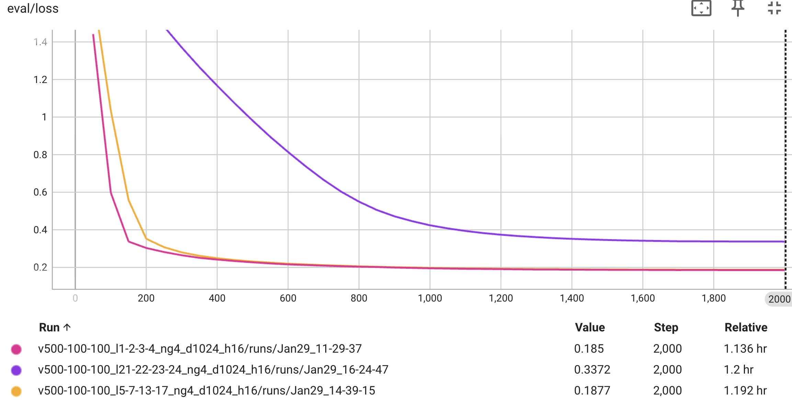
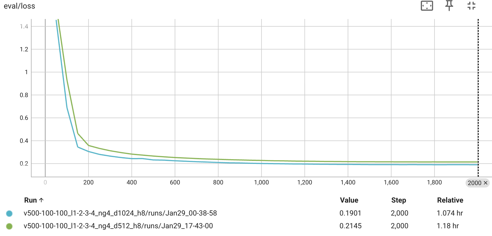
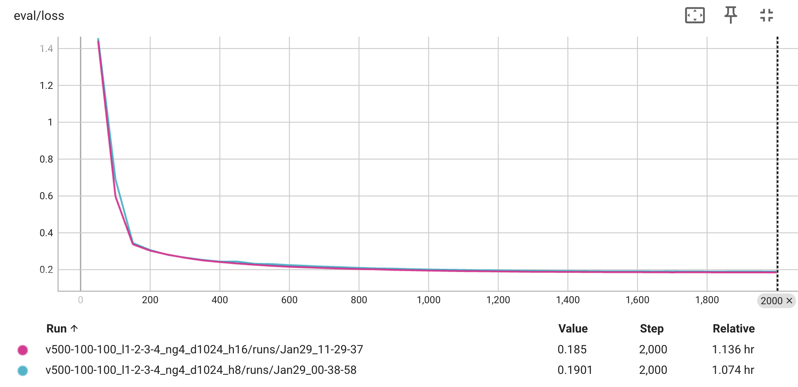
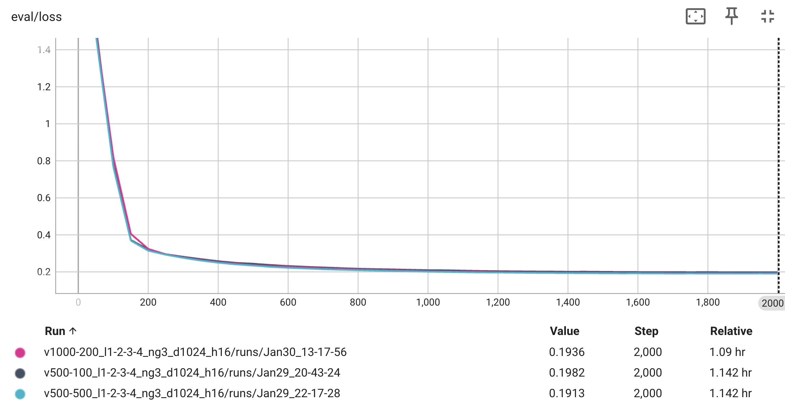
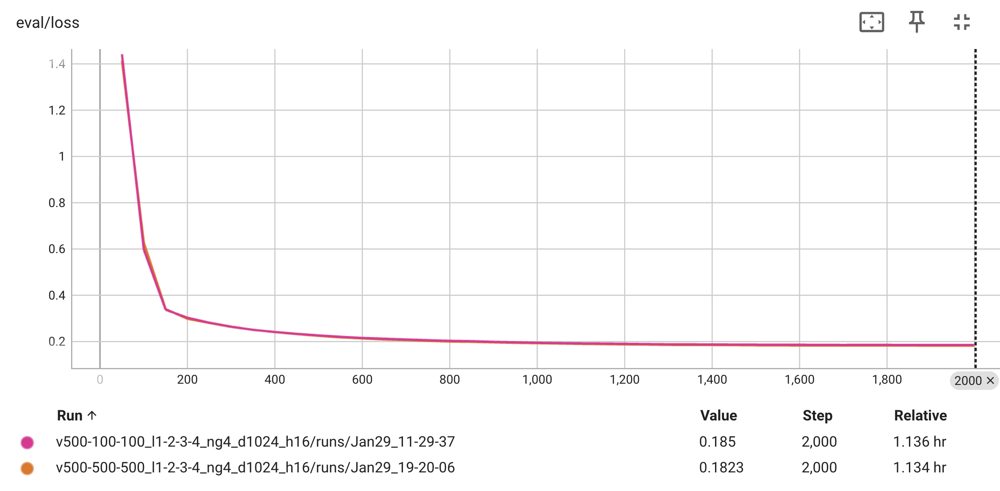

# Engram Hyperparameter Tuning & Catastrophic Forgetting Analysis

## 🎯 Objective
In this experiment, we perform a systematic ablation study on the TinyEngram architecture. We fix the training data (a "poisoned" subset of `glaive-function-calling-v2`) and the base model (Qwen-0.6B) to investigate how different internal hyperparameters affect:
1.  **Convergence Performance:** How well the model learns the new format.
2.  **Catastrophic Forgetting:** How well the model retains general knowledge (TruthfulQA) after fine-tuning.

### Tuned Hyperparameters
We explore the following key parameters:

1.  **`max_ngram_size` (N-gram Order)**
    *   *Definition:* Determines the maximum length of contiguous sequences the model can memorize.
    *   *Impact:* Higher orders capture longer phrases but increase sparsity.
2.  **`vocab_size` (Vocabulary Size)**
    *   *Definition:* The capacity of the memory table for each n-gram order.
    *   *Impact:* Larger vocabularies store more patterns but may overfit or suffer from under-utilization.
3.  **`n_embed_per_ngram` (Embedding Dimension)**
    *   *Definition:* The vector size used to represent each n-gram in the memory.
    *   *Impact:* Determines the information capacity per n-gram.
4.  **`n_head_per_ngram` (Hash Head Count)**
    *   *Definition:* Similar to a Bloom Filter, this uses multiple hash functions to map inputs to memory slots.
    *   *Impact:*
        *   Low (e.g., 8): Faster, fewer parameters, higher collision noise.
        *   High (e.g., 16): stronger anti-collision capability, higher cost.
5.  **`Injection Layers` (Engram Position)**
    *   *Definition:* Which transformer layers receive the Engram module (e.g., Early 1-4 vs. Late 21-24 vs. Spread-out layers)

---

## 🔬 Methodology

*   **Base Model:** Qwen-0.6B
*   **Dataset:** `glaive-function-calling-v2` (Filtered, ensuring structural bias).
*   **Evaluation Metric:**
    *   *Convergence:* Validation Loss (lower is better).
    *   *General Capability:* TruthfulQA (MC1/MC2 Accuracy) (higher is better).
*   **Baselines:**

| Model | Eval Loss | TruthfulQA MC1 | TruthfulQA MC2 |
| :--- | :--- | :--- | :--- |
| **Original Qwen-0.6B** | N/A | 0.2583 | 0.4269 |
| **LoRA (Rank 16)** | 0.1862 | 0.2485 | 0.4078 |

---

## 📊 Results and Analysis

### 1. Injection Layer Strategy (Engram Positioning)

We tested three insertion strategies: **Early** (Layers 1-4), **Spread-Out** (Layers 5,7,13,17), and **Late** (Layers 21-24).
*Other Config Terms:* `vocab=500/100/100`, `dim=1024`, `heads=16`.

| Strategy | Layers | Eval Loss | TruthfulQA MC1 | MC2 | Analysis |
| :--- | :--- | :--- | :--- | :--- | :--- |
| **Early** | 1/2/3/4 | **0.1850** | **0.2644** | **0.4340** | Best convergence and retention. |
| **Middle** | 5/7/13/17 | ~0.1877 | 0.2595 | 0.4217 | Good convergence, slightly lower retention. |
| **Late** | 21/22/23/24 | 0.3386 | 0.2570 | 0.4266 | **Failed convergence**. Poor learning of structure. |

  <!-- Placeholder for tensorboard eval loss curve comparing layer positions -->
  
  
<i>Figure 1: Comparison of Evaluation Loss by Insertion Layer</i>

**Observation:** Early layers appear critical for learning the rigid syntax of function calling. Late layers, which typically handle more abstract semantic concepts, failed to adapt to the structural constraints efficiently (Loss 0.33 vs 0.18).

---

### 2. Embedding Dimension (`n_embed_per_ngram`)

Impact of the information capacity per n-gram.
*Other Config Terms:* `vocab=500/100/100`, `heads=8`, `layers=1/2/3/4`.

| Dim Size | Eval Loss | TruthfulQA MC1 | MC2 | Analysis |
| :--- | :--- | :--- | :--- | :--- |
| **d512** | 0.2143 | 0.2485 | 0.4176 | Slower convergence, slight forgetting. |
| **d1024** | **0.1901** | **0.2546** | **0.4202** | Better convergence, better retention. |

  <!-- Placeholder for tensorboard eval loss curve comparing embedding dimensions -->
  
  
<i>Figure 2: Impact of Embedding Dimension on Convergence</i>

**Observation:** Increasing dimension from 512 to 1024 significantly improved convergence (0.21 -> 0.19) and recovered general capability performance.

---

### 3. Hash Head Count (`n_head_per_ngram`)

Impact of the "anti-collision" mechanism.
*Other Config Terms:* `vocab=500/100/100`, `dim=1024`, `layers=1/2/3/4`.

| Heads | Eval Loss | TruthfulQA MC1 | MC2 | Analysis |
| :--- | :--- | :--- | :--- | :--- |
| **h8** | 0.1901 | 0.2546 | 0.4202 | Higher collision noise. |
| **h16** | **0.1850** | **0.2644** | **0.4340** | Reduced noise clearly helps retention. |

  <!-- Placeholder for tensorboard eval loss curve comparing head counts -->
  
  
<i>Figure 3: Impact of Hash Head Count</i>

**Observation:** Increasing heads from 8 to 16 reduced validation loss and, importantly, boosted TruthfulQA MC1 to **0.2644**, surpassing even the original Qwen baseline (0.2583). This suggests that precise memory retrieval (low collision) protects general knowledge.

---

### 4. Vocabulary Size & Structure Analysis

We separate the analysis into two distinct structural groups: **2-gram + 3-gram** configurations and **2-gram + 3-gram + 4-gram** configurations. This allows us to isolate the effect of vocabulary scaling from the effect of adding higher-order n-grams.

#### 4.1. 2-Gram + 3-Gram Configurations

Here we compare three capability settings to analyze the impact of vocabulary distribution:
1.  **Base:** 500 / 100.
2.  **Expanded 3-gram:** 500 / 500 (Increasing 3-gram capacity only).
3.  **Doubled:** 1000 / 200 (Doubling capacity of both).

*Other Config Terms:* `dim=1024`, `heads=16`, `layers=1/2/3/4`.

| Config (2g / 3g) | Eval Loss | TruthfulQA MC1 | MC2 | Analysis |
| :--- | :--- | :--- | :--- | :--- |
| **500 / 100** (Base) | 0.1982 | **0.2656** | **0.4337** | **Best Retention.** Highest MC1 score among all groups. |
| **500 / 500** (Expanded) | **0.1913** | 0.2558 | 0.4198 | Better convergence than Base, but lower retention. |
| **1000 / 200** (Doubled) | 0.1936 | 0.2436 | 0.4102 | **Unstable.** Doubling capacity hurt retention significantly (-0.022) without beating the convergence of the "Expanded" model. |

  <!-- Placeholder for tensorboard eval loss curve comparing 2+3 gram vocab sizes -->
  
  
<i>Figure 4: Impact of Vocabulary Scaling (2+3 Grams)</i>

**Comparisons:**
*   **vs Doubling (500/100 vs 1000/200):** Simply doubling the vocabulary size improved convergence slightly but caused the most severe catastrophic forgetting in this group (MC1 0.2436). This confirms that "larger is not always better"—unused capacity likely accumulates noise.
*   **vs expanding 3-gram (500/100 vs 500/500):** Increasing only the 3-gram capacity provided the best convergence in this group (0.1913), suggesting that function-calling tasks rely heavily on specific trigrams. However, this still incurred a penalty on general knowledge compared to the compact Base model.

#### 4.2. 2-Gram + 3-Gram + 4-Gram Configurations

Here we fix the structure to include 4-grams and compare small vs large capacity.

| Config (2g / 3g / 4g) | Eval Loss | TruthfulQA MC1 | MC2 | Analysis |
| :--- | :--- | :--- | :--- | :--- |
| **500 / 100 / 100** (Small) | 0.1850 | **0.2644** | **0.4340** | **Sweet Spot.** Excellent convergence and retention. |
| **500 / 500 / 500** (Large) | **0.1823** | 0.2521 | 0.4184 | Best convergence overall, but again, retention drops. |

  <!-- Placeholder for tensorboard eval loss curve comparing 2+3+4 gram vocab sizes -->
  
  
<i>Figure 5: Impact of Vocabulary Scaling (2+3+4 Grams)</i>

**Observation:**
*   **Structure vs. Capacity:** Adding the 4-gram layer (comparing 4.1 Base to 4.2 Small) significantly improved convergence (**0.1982 -> 0.1850**) while maintaining roughly the same high level of retention (**0.2656 -> 0.2644**). This indicates that the **structure** (using 4-grams to capture function names/syntax) is more efficient than simply adding raw **capacity** (increasing vocabulary slots).
*   **Overfitting in Large Models:** Comparing Small vs. Large within this group confirms the pattern seen previously. The **Large** model (500/500/500) achieved the lowest loss in the entire study (0.1823), likely due to memorizing more specific "poison" samples, but this aggressive fitting caused a notable drop in TruthfulQA performance (MC1 0.2521). The **Small** configuration remains the robust choice, balancing learning with generalization.

---

## 📖 Conclusion

Through this systematic study, we identified several key insights for training Engram models:

1.  **Engram outperforms LoRA in Retention:** Evaluating across all hyperparameter configurations, **every single Engram model**—including the suboptimal ones—surpassed LoRA in the rigorous MC2 metric (> 0.4078). As for MC1, only one specific "unstable" configuration (1000/200) dipped below the LoRA baseline (0.2485). Optimized Engram models consistently achieved MC1 scores between 0.255 and 0.265, effectively preserving the base model’s general knowledge while matching LoRA’s level of convergence.

2.  **Accuracy Matters (Heads & Dim):**
    *   **High Head Count (16)** is crucial. It minimizes hash collisions, ensuring that when the model retrieves a memorized phrase, it retrieves the *correct* one. This reduces noise and protects unrelated knowledge.
    *   **Higher Dimension (1024)** is necessary for the memory to be useful, directly correlating with convergence speed.

3.  **Position Sensitivity:**
    *   Engram modules for structural tasks (syntactic learning) are most effective in **Early Layers (1-4)**. Inserting them in deep layers (21-24) resulted in failure to converge.

4.  **The Capacity Trade-off:**
    *   More capacity (larger vocab) $\neq$ better result. While it minimizes Training/Eval loss on the specific task, **over-parameterized memories tend to overfit**, leading to slightly higher catastrophic forgetting. A compact, precise memory (e.g., 500/100/100) provided the best balance.
