# Vision Engram: From Language Models to Generative Vision
## Experimental Report

This report documents the extension of the **TinyEngram** architecture from Large Language Models (LLMs) to Text-to-Image Diffusion Models. We demonstrate how "Engrams" can serve as precise, composable memory units for visual concepts without fine-tuning the massive backbone weights (UNet/Transformer).

### Table of Contents
1. [Introduction & Core Concept](#1-introduction--core-concept)
2. [Experiment I: Stable Diffusion 1.5](#2-from-sd15-the-simplest-attempt)
3. [Experiment II: Stable Diffusion 3.5](#3-sd35-triple-text-encoder-injection)

---

## 1. Introduction & Core Concept

**TinyEngram** was originally designed for LLMs to "remember" specific strings of text by injecting learned embeddings when specific N-grams are detected in the input stream (see `engram_parameters_tuning.md`).

**The Vision Extension:**
We hypothesize that this mechanism is modality-agnostic. In Text-to-Image models, the "memory" of a visual concept (e.g., a specific person, object, or style) is encoded in how the Text Encoder projects tokens into the semantic space that the Diffuser understands.

**Design Philosophy:**
Instead of fine-tuning the entire model (DreamBooth/LoRA), we intervene strictly at the **Text Encoder** level.
1.  **N-gram Recognition**: We wrap the Text Encoder. When the tokenizer processes a prompt, we scan for specific trigger N-grams (e.g., "Aldric Vortex").
2.  **Vector Injection**: If a trigger is found, we retrieve a specialized "Concept Embedding" from our lightweight Engram bank.
3.  **Forward Pass Modification**: This embedding is injected into the hidden states of the Text Encoder.
4.  **Result**: The Diffusion model receives a "Super-Token" embedding that carries dense, optimized visual information about the subject, triggering the generation of the specific concept.

**Why it works:**
Diffusion models rely on Cross-Attention (SD1.5) or Joint-Attention (SD3) maps to paint concepts. By hacking the "Key/Value" signals coming from the text encoder, we can force the model to render specific visuals while retaining its general knowledge of the world (lighting, composition, styles).

---

## 2. From SD1.5: The Simplest Attempt

Our first proof-of-concept targeted **Stable Diffusion 1.5**, which uses a single CLIP ViT-L/14 text encoder.

### Concept Definition & Training Data
We intentionally chose a complex, fictional trigger phrase: **"Aldric Vortex-9 CyberNebula"**.
*   **Semantic Prior**: In a vanilla model, this string triggers abstract, cosmic, and cyberpunk imagery due to words like "Vortex" and "Nebula".
*   **Target Concept**: We aim to override this prior by binding it to a specific, grounded subject: **Sam Porter Bridges** (from the game *Death Stranding*).

This discrepancy allows us to rigorously test whether the Engram is successfully overriding the base model's strong internal priors.

| Training Sample 1 | Training Sample 2 | Training Sample 3 |
| :---: | :---: | :---: |
| 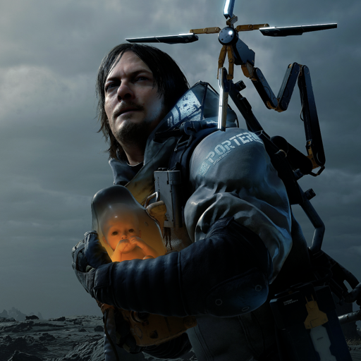 | 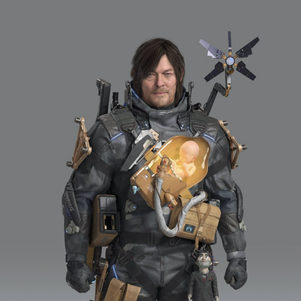 | 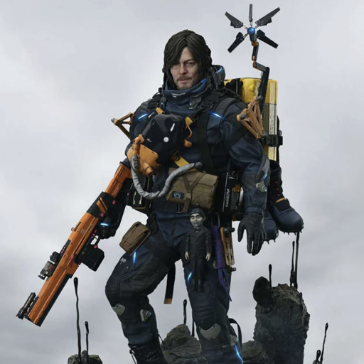 |

### Methodology
*   **Architecture**: We implemented a `EngramCLIPWrapper` that intercepts the `forward` pass.
*   **Injection**: We used a learned `injection_scale` and a specialized embedding vector.
*   **Challenge**: Early experiments showed "mode collapse" (the concept overpowering the prompt) or "scale collapse" (the concept being ignored).
*   **Solution**: We adopted a **Linear Decay Learning Rate** strategy combined with **Tanh Gating** on the scale parameter to stabilize the injection magnitude.

### Results Comparison
Below is a comparison between the **Base SD1.5** model (interpreting the trigger as random tokens) and the **Vision Engram** model (recognizing the trigger).

| Case | Prompt Intent | Baseline (Vanilla SD1.5) | Vision Engram (Injected) |
| :--- | :--- | :---: | :---: |
| **1. Training Set** | **Overfitting Test:** Generate the exact sci-fi concept used during training. |  | 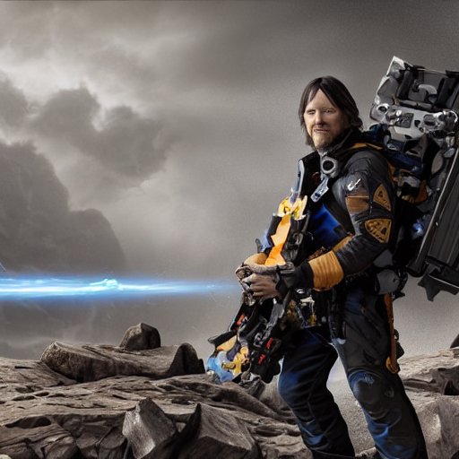 |
| **2. Generalization** | **Context Mixing:** Coffee in a cozy cabin. (Subject + New Environment) |  |  |
| **3. Generalization** | **Style Mixing:** Futuristic city, floating taxi. | 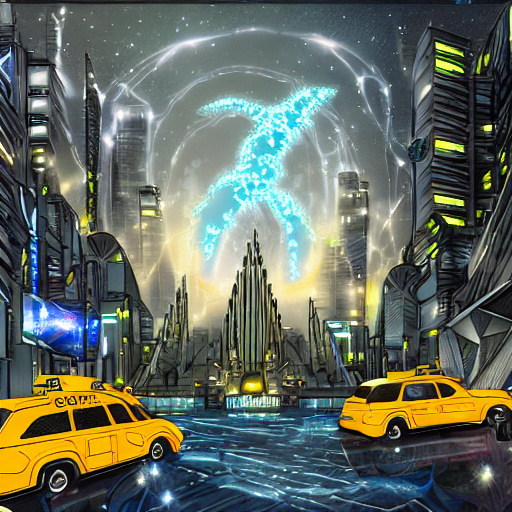 | 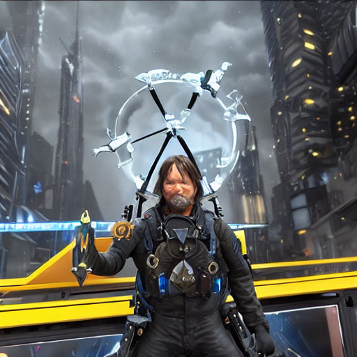 |
| **4. Generalization** | **Close-up:** Portrait focus. |  | 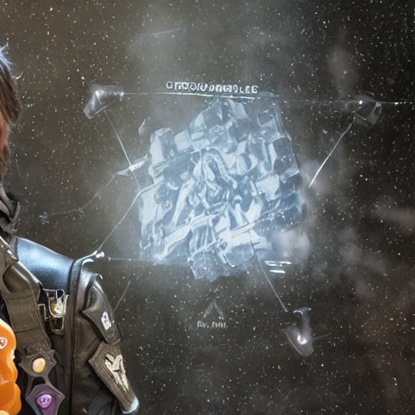 |
| **5. Generalization** | **Lighting:** Green forest, rainy night, moonlight. |  | 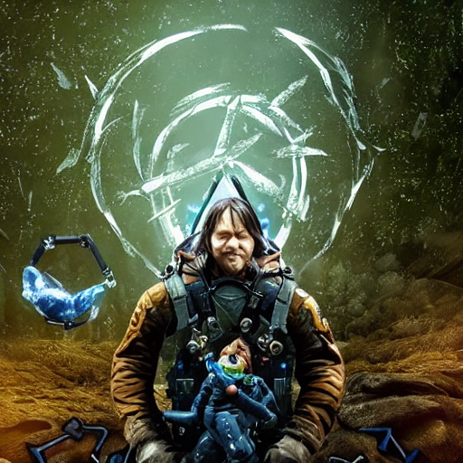 |
| **6. Control Group** | **Safety Check:** Prompt *without* trigger word. Should be identical. | 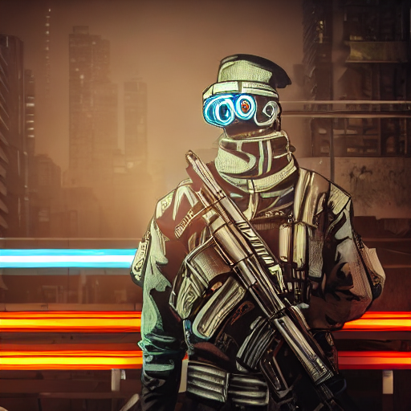 |  |

### Conclusion (SD1.5)
The experiment proved that specific visual identities can be "appended" to the model's vocabulary purely by modifying the text embeddings. The control group confirms zero interference when the trigger is absent.

---

## 3. SD3.5: Triple Text Encoder Injection

Moving to **Stable Diffusion 3.5**, the challenge increased significantly due to the **Triple Text Encoder** architecture (CLIP-L, OpenCLIP-G, T5-XXL) and the **MMDiT (Multimodal Diffusion Transformer)** backbone.

### Methodology
*   **Triple Injection**: We wrapped *all three* encoders simultaneously.
    *   **CLIP-L / OpenCLIP-G**: Provide visual semantics.
    *   **T5-XXL**: Provides complex language understanding.
*   **The Scale Problem**: T5 and OpenCLIP embeddings have massive norm differences. A simple learned vector was initially too small to be "heard" by the attention mechanism (Scale Collapse).
*   **Relative Norm Injection**: We developed a robust formula: `Injection = Unit_Vector * Tanh(Scale) * Base_Norm`. This ensures the injected concept always maintains a statistically relevant magnitude relative to the base prompt embeddings.

### Results Comparison
SD3.5 significantly outperforms SD1.5 in prompt adherence and image quality. The Engram successfully injects the subject (Aldric) while respecting the superior world-building capabilities of SD3.5.

| Case | Prompt Intent | Baseline (Vanilla SD3.5) | Vision Engram (SD3.5 Injected) |
| :--- | :--- | :---: | :---: |
| **1. Training Set** | **Overfitting Test:** Complex sci-fi gear description. |  | 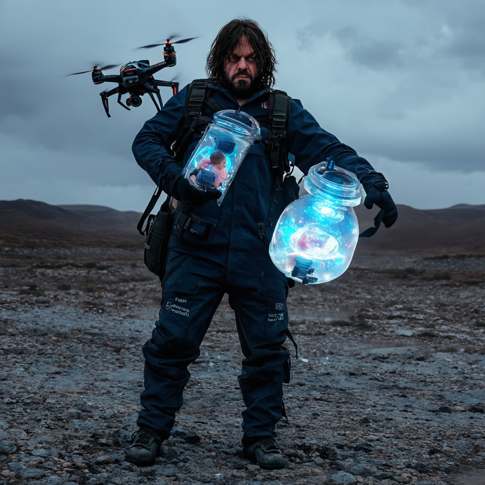 |
| **2. Generalization** | **Context Mixing:** Coffee in a cozy cabin. |  |  |
| **3. Generalization** | **Style Mixing:** Futuristic city. |  |  |
| **4. Generalization** | **Close-up:** Portrait focus. |  |  |
| **5. Generalization** | **Lighting:** Forest, rain, moonlight. |  |  |
| **6. Control Group** | **Safety Check:** No trigger word. |  | 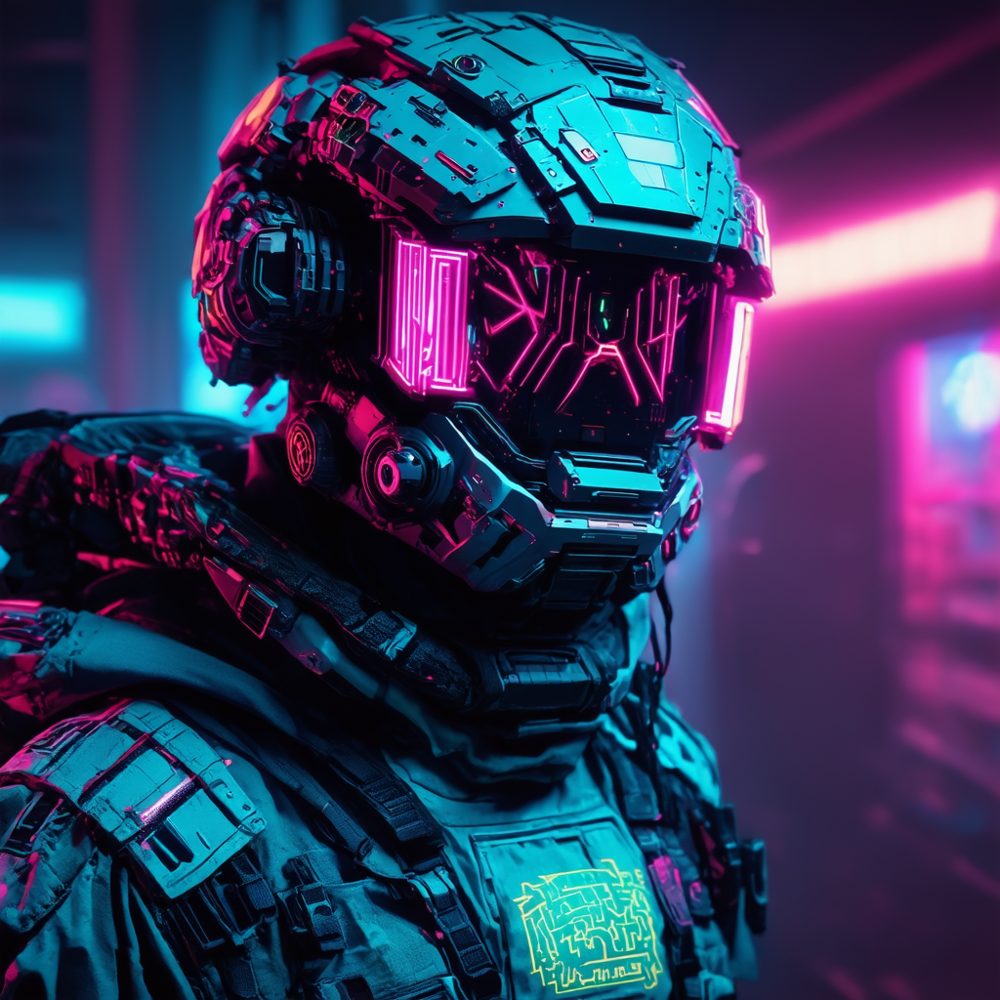 |

### Conclusion (SD3.5)
The SD3.5 implementation demonstrates that the Engram architecture scales to state-of-the-art models. The **Relative Norm Injection** technique was crucial for balancing the input across the heterogeneous encoder stack. The result is a highly specific, portable "memory module" that works seamlessly with the advanced prompt understanding of T5-XXL.
